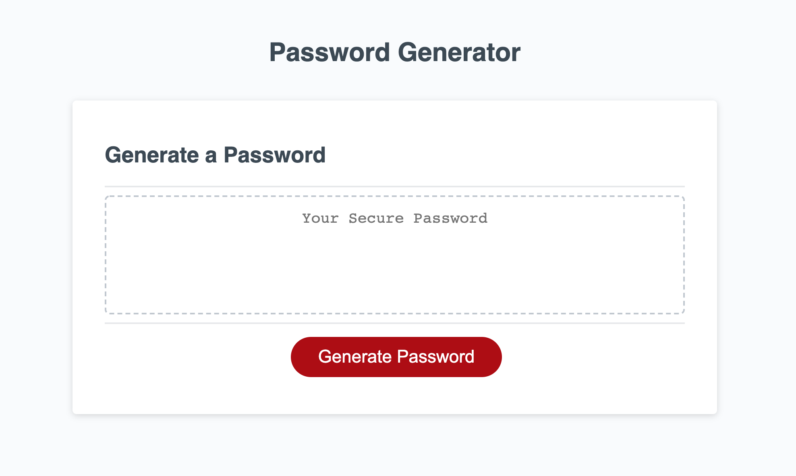
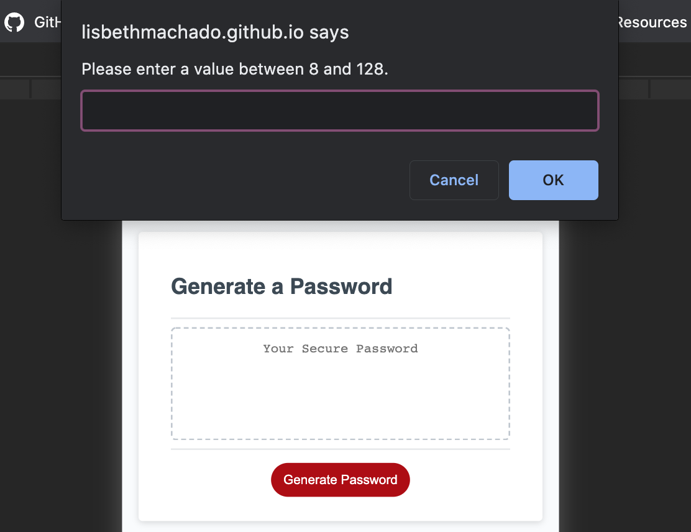
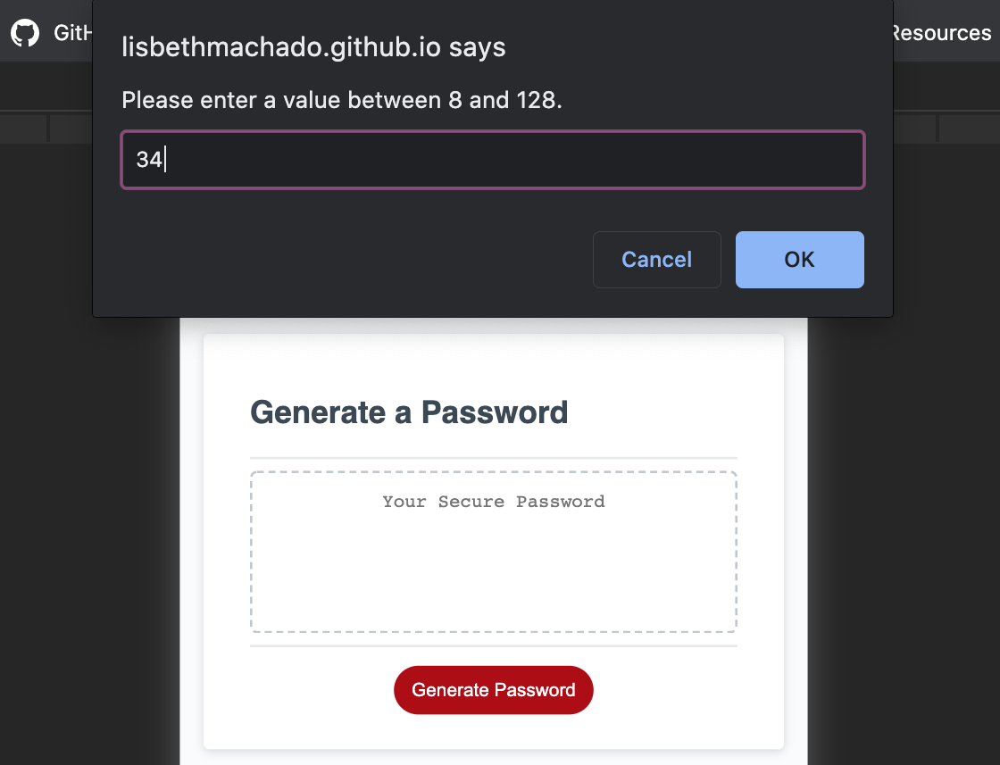
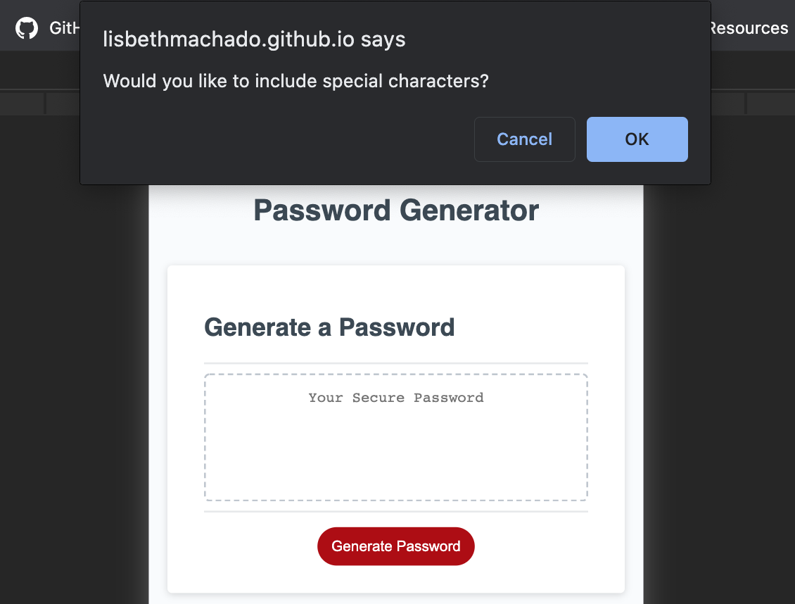
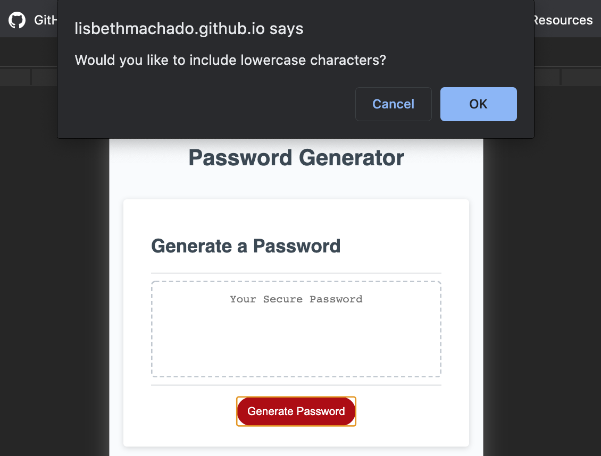
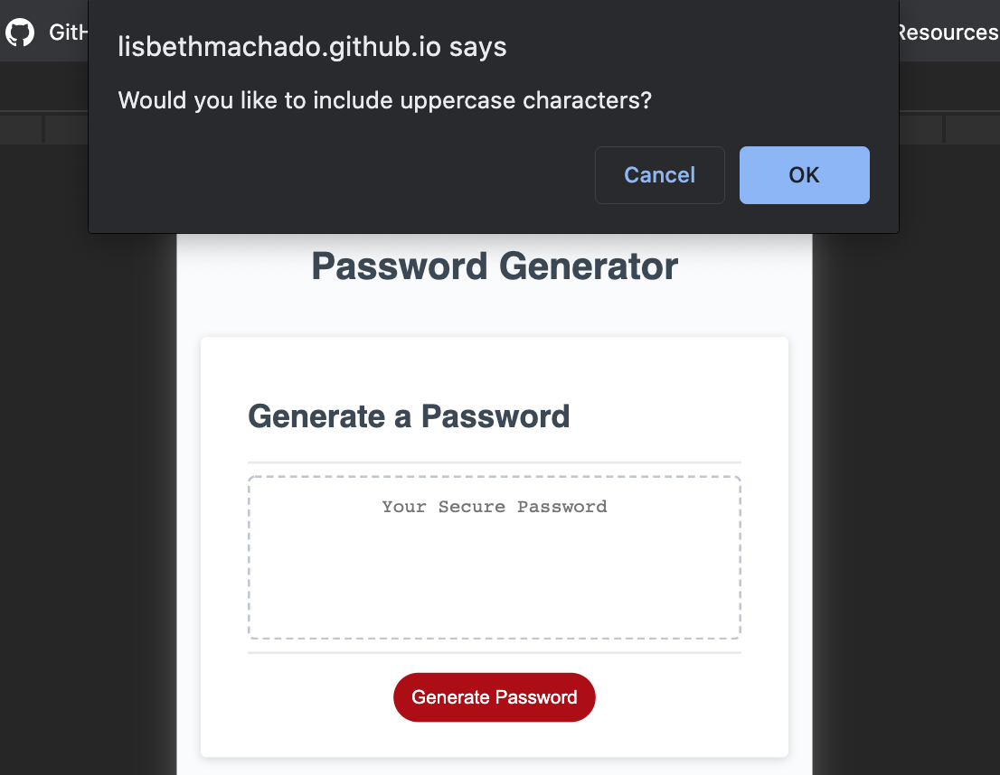
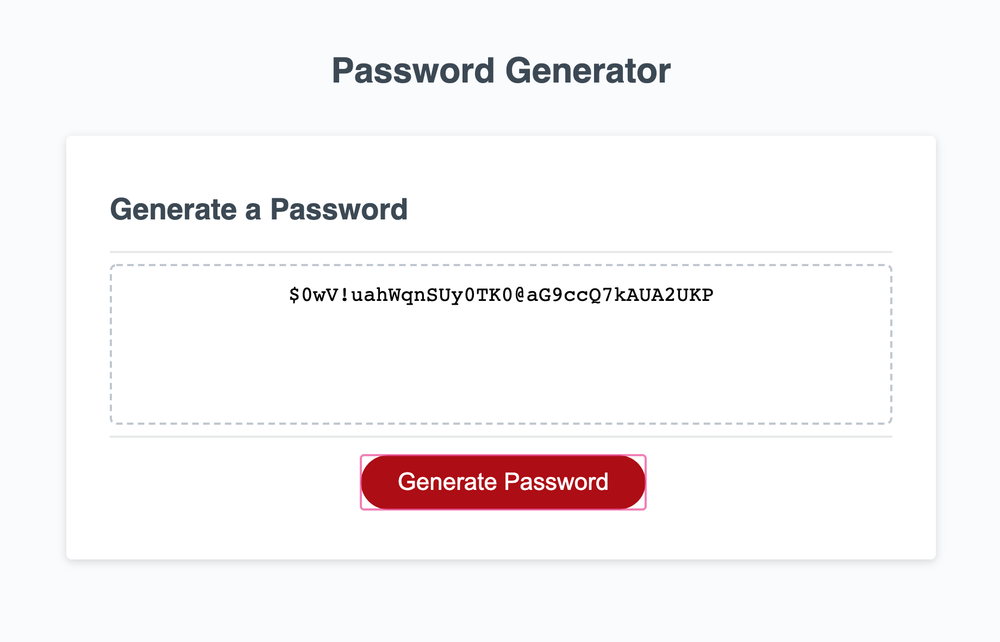

# Password Generator

## Description

This is a random password generator web application. Create high-security passwords by answering a few simple questions in the web browser to set custom criteria. I contributed by applying a basic algorithm to sort through the data provided to make random password combinations based on the user's selections.

## Table of Contents    
* [Quick Start](#quick-start)
* [Installation](#installation)
* [Usage](#usage)
* [Screenshots](#screenshots)
* [License](#license)
* [Questions](#questions)  

## Quick Start
Open the web application in your web browser and begin by clicking on the red "Generate Password" button. Answer the alerted questions to set the criteria for the password. After submitting all desired password requirements, a random code combination will render in place of the Password Generator "Your Secure Passowrd" text container.

## Installation
To install project locally clone repository.

## Usage 
Start the application in the web browser and begin by answering the alerted questions. Use this application to create high-security password combinations in an instance.
      
## Screenshots

## License
This project is licensed under the terms of the MIT license. 
More information is available at [opensource.org/licenses](https://opensource.org/licenses/MIT)

## Questions
### Lisbeth Machado
* :octocat: [Github](http://www.github.com/lisbethmachado).
* 📧 [E-mail](mailto:lisbeth.webdev@gmail.com)
